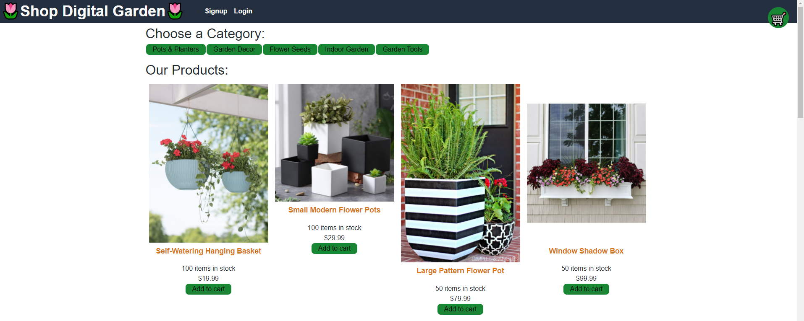
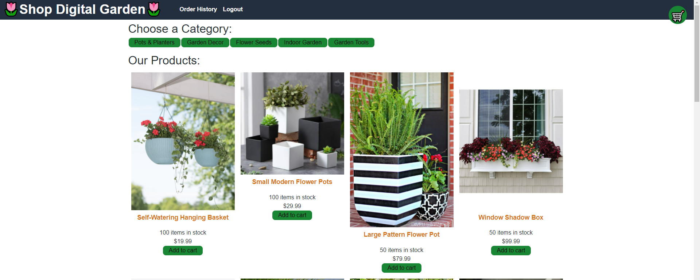
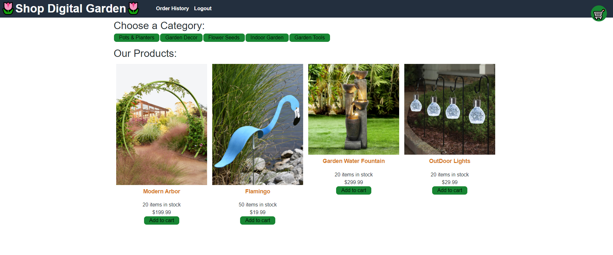
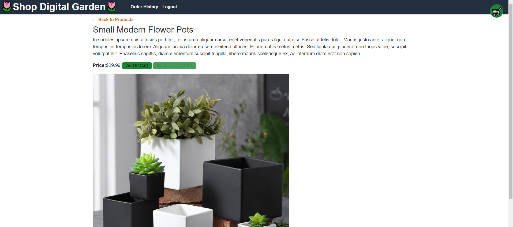
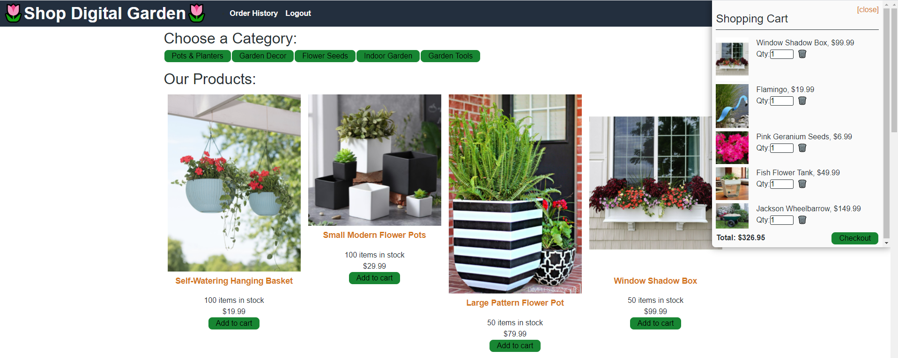

# 🌷Shop Digital Garden🌷

## **Project Summary** ⚡️

_Shop Digital Garden to buy product for your outdoor and in home garden. We have the latest items for the best prices. 
Choose which category you would like to browse and matching products will populate. Once items are added to you chart, checkout with using our stripe payment method._

__________________________________________________________________________________________________________________________________________________

## **Tools Used** 🛠️

* Node.js
* npm (Node Package)
* Javascript
* React
* React Router
* CSS
* Graphql
* MongoDB
* Mongoose
* Express JS
* React-Redux
* Apollo-Express
* Stripe

___________________________________________________________________________________________________________________________________________________

## **Website** 📷

___________________________________________________________________________________________________________________________________________________
## **Contributors** 🧑‍💻

[Katherine Y : Github](https://github.com/katherineyoguez)

[Thu L : Github](https://github.com/thuluong249)

[Stephanie G : Github](https://github.com/sbgastondesign)

[Joel B : Github](https://github.com/JoelBal)

## **Recourses** 💡

[Katherine Y : Github](https://github.com/katherineyoguez/DigitalGarden)

[Heroku : Live App](https://vast-headland-80627.herokuapp.com/)

____________________________________________________________________________________________________________________